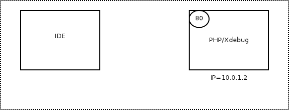

# Configurando Xdebug em servidor remoto

# Configure o  Xdebug
#### Atenção o  xdebug.remote_port é a Porta do config vscode .

    zend_extension=xdebug.so
    xdebug.remote_enable=on
    xdebug.remote_handler=dbgp
    xdebug.remote_port=9000
    xdebug.remote_autostart=on
    xdebug.remote_connect_back=on
    xdebug.idekey=docker
    xdebug.remote_log=/var/log/xdebug.log
    xdebug.default_enable=on

# vs code 
####  o arquivo .vscode/launch.json .
 
####  Atenção para o mapeamento de arquivos .

"pathMappings": {
                    "servidor remoto": "pasta local de sesenvolvimento"
                }

    {
        "version": "0.2.0",
        "configurations": [
            {
                "name": "Listen for XDebug",
                "type": "php",
                "request": "launch",
                "port": 9000,
                "log" : true,
                "stopOnEntry": true,
                "pathMappings": {
                    "/var/www/html": "/home/gleison/Workspace/TemplateMagento/src"
                }
            },
            {
                "name": "Launch currently open script",
                "type": "php",
                "request": "launch",
                "program": "${file}",
                "cwd": "${fileDirname}",
                "port": 9000
            }
        ]
    }

